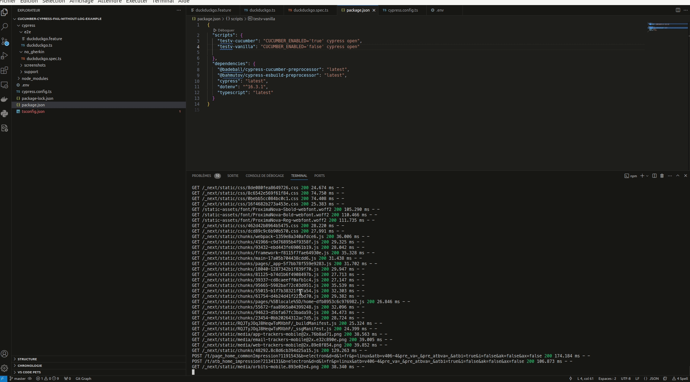

# Cucumber cypress fail without log preview

This project is a minimal reproducible example to shows the lack of error log when there is a failing test script. This error only occurs when using the cucumber-cypress-preprocessor.

# Get started

Clone the project, then:

```bash
npm install
```

## Two simple scripts available

### Script 1: Run a failing scenario using cucumber-cypress-preprocessor

```bash
npm run testv-cucumber
```

### Script 2: Run a failing scenario using vanilla Cypress

```bash
npm run testv-vanilla
```


